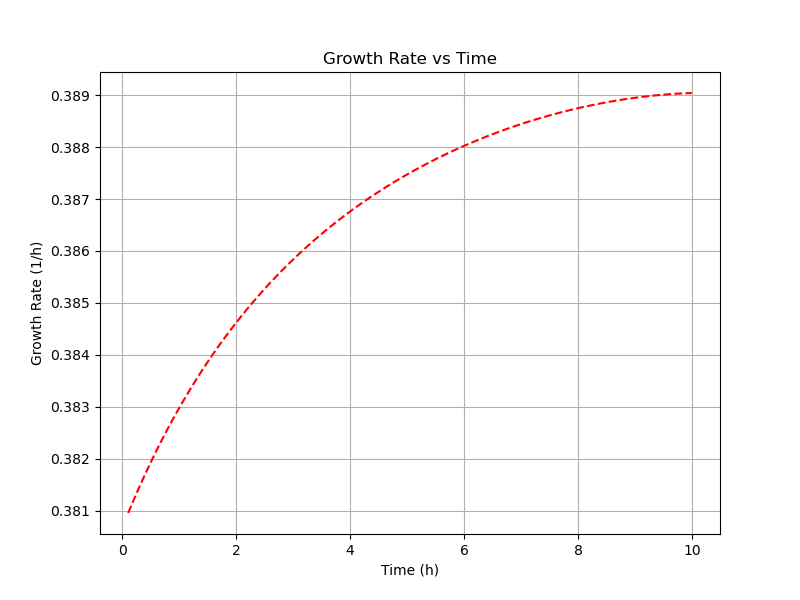

# BioReact: Dynamic Simulation of a Continuous Stirred Tank Bioreactor (CSTR)

## Overview
**BioReact** is a Python-based simulation tool designed to model the dynamic behavior of a Continuous Stirred Tank Bioreactor (CSTR). It enables users to analyze the evolution of biomass, substrate, and growth rates over time using the fourth-order Runge-Kutta method. The tool is particularly suited for researchers, students, and engineers in the fields of biotechnology and bioengineering.

### Features
1. **Dynamic Simulation**:
   - Models the concentrations of biomass and substrate over time.
   - Tracks specific growth rate (\( \mu \)) dynamically using the Monod model.

2. **Visualization**:
   - Automatically generates plots for:
     - Biomass vs. Substrate (Phase Diagram).
     - Biomass and Substrate vs. Time.
     - Growth Rate vs. Time.
   - Saves all plots in a dedicated `figures` directory with consistent dimensions and transparent backgrounds.

3. **Customizable Parameters**:
   - Allows users to specify reactor conditions, microbial kinetics, and simulation parameters to suit different scenarios.

4. **Examples of Generated Visualizations**:
   - **Biomass vs Substrate (Phase Diagram)**:
     
   - **Biomass and Substrate vs Time**:
     
   - **Growth Rate vs Time**:
     

---

## How It Works

The simulation is based on the following equations:

1. **Biomass Balance**:
   \[
   \frac{dX}{dt} = X \cdot (\mu - D)
   \]

2. **Substrate Balance**:
   \[
   \frac{dS}{dt} = D \cdot (S_f - S) - \frac{\mu \cdot X}{Y}
   \]

3. **Growth Rate (Monod Model)**:
   \[
   \mu = \frac{\mu_{\text{max}} \cdot S}{K_s + S}
   \]

### Parameters
- \( X \): Biomass concentration (g/L).
- \( S \): Substrate concentration (g/L).
- \( D \): Dilution rate (\( F / V \), 1/h).
- \( S_f \): Feed substrate concentration (g/L).
- \( \mu \): Specific growth rate (1/h).
- \( Y \): Biomass yield coefficient (g biomass/g substrate).
- \( \mu_{\text{max}} \): Maximum specific growth rate (1/h).
- \( K_s \): Substrate affinity constant (g/L).

---

## Getting Started

### Prerequisites
Ensure you have Python 3.8+ installed along with the following libraries:
- `numpy`
- `pandas`
- `matplotlib`

Install the required libraries using pip:
```bash
pip install numpy pandas matplotlib
```

---

### Usage

1. Clone the repository:
   ```bash
   git clone https://github.com/yourusername/BioReact.git
   cd BioReact
   ```

2. Run the simulation:
   Define your reactor parameters and execute the simulation. Example script:
   ```python
   from cstr_simulation import runge_kutta_4, plot_biomass_vs_substrate, plot_biomass_and_substrate_vs_time, plot_growth_rate_vs_time

   # Simulation parameters
   initial_time = 0.0
   initial_biomass = 0.1
   initial_substrate = 20.0
   yield_coefficient = 0.5
   step_size = 0.1
   mu_max = 0.4
   Ks = 1.0
   reactor_volume = 1.0
   flow_rate = 0.1
   substrate_feed = 50.0
   simulation_steps = 100

   # Run simulation
   results = runge_kutta_4(
       time=initial_time,
       biomass=initial_biomass,
       substrate=initial_substrate,
       yield_factor=yield_coefficient,
       step_size=step_size,
       mu_max=mu_max,
       Ks=Ks,
       volume=reactor_volume,
       flow_rate=flow_rate,
       substrate_feed=substrate_feed,
       steps=simulation_steps,
   )

   # Generate plots
   plot_biomass_vs_substrate(results)
   plot_biomass_and_substrate_vs_time(results)
   plot_growth_rate_vs_time(results)
   ```

3. Review the results:
   - The simulation outputs a DataFrame with the following columns:
     - `Time (h)`
     - `Biomass (g/L)`
     - `Substrate (g/L)`
     - `Growth Rate (1/h)`
   - The plots are saved in the `figures` directory.

---

## Repository Structure
The repository is organized as follows:

```plaintext
BioReact/
│
├── cstr_simulation.py       # Core simulation and plotting functions
├── examples/
│   ├── example_run.py       # Example script demonstrating usage
│   └── example_notebook.ipynb # Example Jupyter Notebook
├── figures/                 # Contains generated plots
│   ├── biomass_vs_substrate.png
│   ├── biomass_and_substrate_vs_time.png
│   └── growth_rate_vs_time.png
├── README.md                # Documentation
└── LICENSE                  # License for the repository
```

---

## Future Development
Planned features include:
- Advanced visualizations for parameter sensitivity analysis.
- Enhanced support for batch and fed-batch reactor models.
- Integration with experimental data for validation.

---

## Authors
**Emiliano Balderas Ramírez**  
PhD Student at the Instituto de Biotecnología, UNAM  
Email: [ebalderas@live.com.mx](mailto:ebalderas@live.com.mx)  
Phone: +52 2221075693  

**Dr. Octavio Tonatiuh Ramírez Reivich**  
Principal Investigator, Instituto de Biotecnología, UNAM  
Email: [tonatiuh.ramirez@ibt.unam.mx](mailto:tonatiuh.ramirez@ibt.unam.mx)  

---

## License
This project is licensed under the MIT License. See the `LICENSE` file for details.

---

## Contact
For questions or suggestions, feel free to contact:  
**Emiliano Balderas Ramírez**  
PhD Student at the Instituto de Biotecnología, UNAM  
Email: [ebalderas@live.com.mx](mailto:ebalderas@live.com.mx)  
Phone: +52 2221075693  